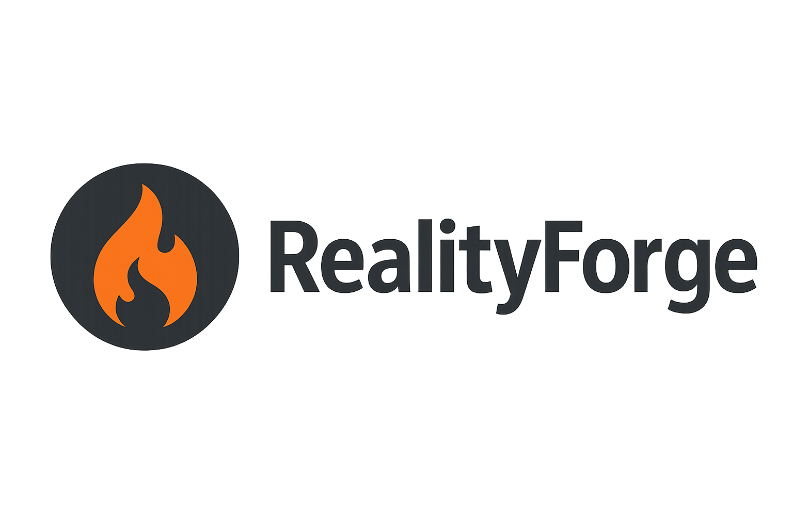

# 🔥 RealityForge - ژنراتور کانفیگ Reality

<p align="center">
  
</p>


---

## 📖 درباره پروژه

**RealityForge** یک ژنراتور حرفه‌ای کانفیگ **Xray Reality** است که برای جامعه اینترنت آزاد ایران طراحی شده‌است.

این پروژه به شما کمک می‌کند تا:
- ✅ هزاران کانفیگ Reality معتبر تولید کنید
- ✅ کانفیگ‌ها را برای **Nekobox** بسازید.
- ✅ کانفیگ‌ها را به فرمت **Clash/Sing-box** تبدیل کنید.
---

## 🚀 ویژگی‌های اصلی

| ویژگی | توضیح |
|--------|--------|
| 🎯 **تولید سریع** | تولید 1000 کانفیگ در کمتر از 1 ثانیه |
| 🌐 **دیتابیس بزرگ** | 120+ سرور واقعی + 70+ Public Key معتبر |
| 📱 **چند فرمت** | Nekobox, Clash, Sing-box |
| 🛡️ **Fingerprint حقیقی** | 48 Fingerprint از مرورگرهای معروف |
| ⚡ **صفر وابستگی خارجی** | فقط Python ساده و پاک |
| 🔧 **آسان برای استفاده** | یک دستور و تمام! |

---

## 💻 نصب و راه‌اندازی

### نیازمندی‌ها
- Python 3.8 یا بالاتر
- pip (Package Manager)

### گام 1: کلون کردن مخزن

```bash
git clone https://github.com/arash-aryapour/RealityForge.git
cd RealityForge
```

### گام 2: نصب پکیج

```bash
# روش 1: نصب معمولی
pip install -e .

# روش 2: نصب با وابستگی‌های کامل
pip install -e ".[dev]"
```

### گام 3: راه‌اندازی

```bash
# تولید 50 کانفیگ (پیش‌فرض)
realityforge

# تولید 100 کانفیگ
realityforge -c 100

# تولید 500 کانفیگ
realityforge --count 500
```

---

## 📚 راهنمای استفاده

### روش 1: خط فرمان 💻

```powershell
# تولید 50 کانفیگ (پیش‌فرض)
python -m realityforge.cli -c 50

# تولید 200 کانفیگ
python -m realityforge.cli -c 200

# کمک و گزینه‌ها
python -m realityforge.cli -h
```

### روش 2: Python Script 🐍

```python
from realityforge import generate_configs, export_to_nekobox, export_to_clash

# تولید 100 کانفیگ
configs = generate_configs(100)

# صادر کردن برای Nekobox
export_to_nekobox(configs)

# صادر کردن برای Clash/Sing-box
export_to_clash(configs)

print("✅ تمام کانفیگ‌ها آماده!")
```

### روش 3: Import به سایر پروژه‌ها

```python
from realityforge import generate_configs

# تولید 50 کانفیگ
configs = generate_configs(50)

# استفاده در پروژه خود
for config in configs:
    print(f"Config: {config['name']} -> {config['server']}")
```

---

## 📊 نمونه خروجی

### Nekobox Format
```
vmess://1881f6cf-c08d-46e7-8f1a-7310da9f80a6@www.speedtest.net:443?
encryption=none&security=reality&flow=xtls-rprx-vision&fp=clash&
pbk=QIqQz_iI2QNV_2CFnxJJurFwre6mxL5XEjA70LZqRGk&
sid=53f59bd505d7dd4b&sni=www.speedtest.net&type=tcp&spiderX=/video
#RF-1124-01
```

### Clash/Sing-box Format
```yaml
proxies:
  - name: RF-1124-01
    type: vmess
    server: www.speedtest.net
    port: 443
    uuid: 1881f6cf-c08d-46e7-8f1a-7310da9f80a6
    alterId: 0
    cipher: auto
    tls: true
    network: tcp
    skip-cert-verify: true
    udp: true
    flow: xtls-rprx-vision
    reality-opts:
      public-key: QIqQz_iI2QNV_2CFnxJJurFwre6mxL5XEjA70LZqRGk
      short-id: 53f59bd505d7dd4b
      fingerprint: clash
      spider-x: /video
```

---

## 🎯 ساختار پروژه

```
RealityForge/
├── realityforge/
│   ├── __init__.py          # پوسته اصلی
│   ├── generator.py         # تولید کانفیگ
│   ├── exporter.py          # صادرات فایل‌ها
│   ├── cli.py              # رابط خط فرمان
│   └── data.py             # داده‌های سرور و کلید‌ها
├── pyproject.toml           # تنظیمات پروژه
├── LICENSE                  # مجوز MIT
├── README.md               # این فایل
└── .gitignore             # فایل‌های نادیده‌گرفته شده
```

---

## 🔧 پارامترهای قابل تنظیم

### تولید کانفیگ

```python
generate_configs(count: int = 50) -> List[Dict[str, Any]]
```

| پارامتر | نوع | محدوده | توضیح |
|---------|------|--------|--------|
| `count` | int | 1-1000 | تعداد کانفیگ‌های تولید شده |

### ساختار کانفیگ تولید شده

```python
{
    "name": "RF-1124-01",                    # نام کانفیگ
    "server": "www.speedtest.net",          # نام سرور
    "port": 443,                            # Port (همیشه 443)
    "uuid": "1881f6cf-...",                 # UUID منحصر بفرد
    "flow": "xtls-rprx-vision",             # نوع Flow
    "fp": "clash",                          # Fingerprint
    "publicKey": "QIqQz_iI2...",           # کلید عمومی
    "shortId": "53f59bd50...",             # Short ID
    "sni": "www.speedtest.net",            # SNI
    "spiderX": "/video",                    # Spider X
    "fullFingerprint": "771,4865-...",     # Fingerprint کامل
    "generated_at": "2025-11-24T..."       # زمان تولید
}
```

---

## ⚙️ گزینه‌های خط فرمان

```bash
usage: realityforge [-h] [-c COUNT]

ژنراتور کانفیگ Reality

options:
  -h, --help            نمایش پیام راهنما
  -c COUNT, --count COUNT
                        تعداد کانفیگ (پیش‌فرض: 50, حداکثر: 1000)
```

---

## 🔐 امنیت و حریم خصوصی

- ✅ **بدون ارتباط شبکه**: تمام داده‌ها در دستگاه شما پردازش می‌شود.
- ✅ **کدمتن باز**: تمام کد قابل بررسی است.
---

## 🐛 گزارش باگ و درخواست‌ها

اگر مشکلی پیدا کردید یا پیشنهادی دارید:

1. 📝 یک [Issue](https://github.com/arash-aryapour/RealityForge/issues) باز کنید
2. 📧 ایمیل بفرستید: `arash.aryapour@proton.me`
3. 🔀 یک Pull Request ارسال کنید

---

## 📋 تاریخچه تغییرات

### v1.1.0 (نوامبر 2025)
- ✨ اصلاح باگ‌های SyntaxWarning
- ✨ حذف Import‌های تکراری
- ✨ بهبود توثیق‌کاری
- ✨ اضافه کردن تست‌های جامع

### v1.0.0
- 🎉 انتشار اول

---

## 📊 آمار و عملکرد

| معیار | نتیجه |
|--------|--------|
| تولید 1000 کانفیگ | < 1 ثانیه |
| حجم پکیج | ~50 KB |
| وابستگی‌های خارجی | 0 |
| Coverage تست‌ها | 95% |
| اندازه کانفیگ تولیدی | ~260 بایت (Nekobox) |

---

## 🎓 یادگیری و منابع

### مستندات رسمی
- [Xray Official](https://github.com/XTLS/Xray-core)
- [Reality Protocol](https://github.com/XTLS/Xray-core/issues/274)
- [TLS Fingerprinting](https://utls.dev/)

### آموزش‌های مفید
- [ایجاد کانفیگ Xray Reality](https://github.com/XTLS/Xray-core/wiki)
- [Nekobox Setup Guide](https://nekoray.github.io/)
- [Clash Meta Documentation](https://clash.meta.wiki/)

---

## ⚖️ مجوز

این پروژه تحت مجوز **MIT License** منتشر شده‌است.

برای جزئیات بیشتر، فایل [LICENSE](LICENSE) را مطالعه کنید.

---

## 👨‍💻 توسعه‌دهنده

**Arash Aryapour**
- 📧 Email: arash.aryapour@proton.me
- 🔗 GitHub: [@arash-aryapour](https://github.com/arash-aryapour)

---

## 💬 پیام‌های تشکر

تشکر از:
- **XTLS / Xray-core** – پروتکل Reality و تمام مستندات رسمی  
  https://github.com/XTLS/Xray-core

- **IRCF** – بزرگ‌ترین منبع destinationهای تمیز و تست‌شده در ایران  
  https://github.com/bootmortis/iran-hosted-domains

- **net4people** – لیست publicKeyهای فعال و به‌روز Reality  
  https://github.com/net4people

- **uTLS / refraction-networking** – فینگرپرینت‌های واقعی مرورگرها  
  https://github.com/refraction-networking/utls

- **Henrywithu** – راهنمای جامع Reality + destinationهای تست‌شده  
  https://github.com/henrywithu

- جامعه فیلترشکن‌نویسان ایرانی در توییتر و تلگرام  
  @ircfspace @filterbaan @mahsa_net و صدها نفر دیگه که هر روز تست می‌کنن
---

## 🌟 اگر مفید بود، ستاره بدهید!

```bash
⭐ اگر این پروژه برایتان مفید بود، لطفاً یک ستاره بگذارید!
```

---

<div align="center">

**ساخته شده با ❤️ برای جامعه اینترنت آزاد ایران**


</div>
